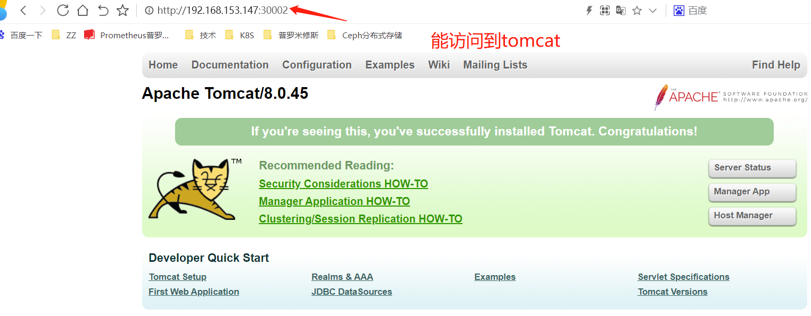
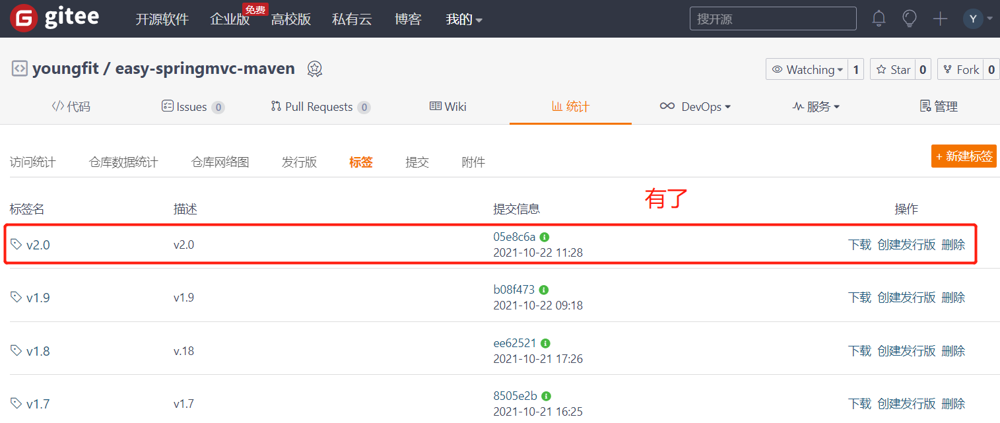
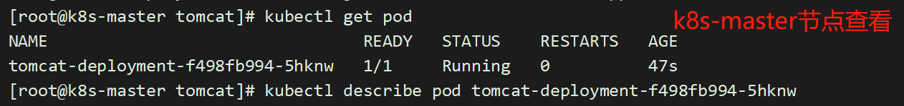
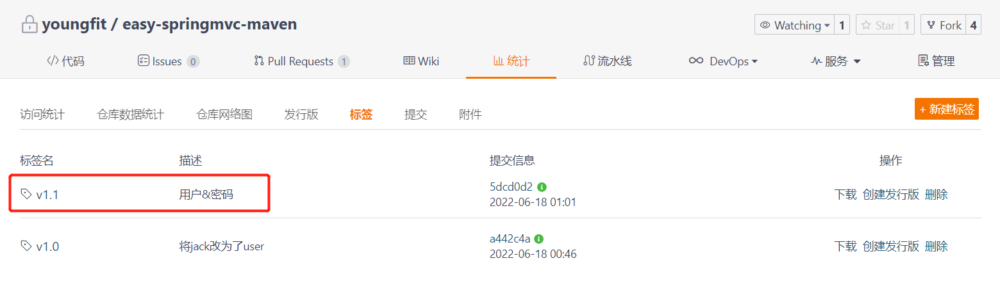
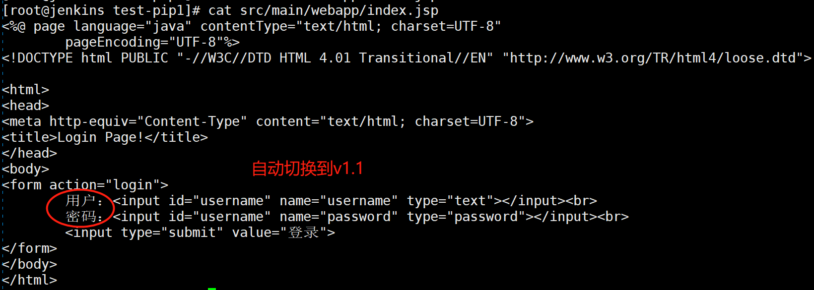
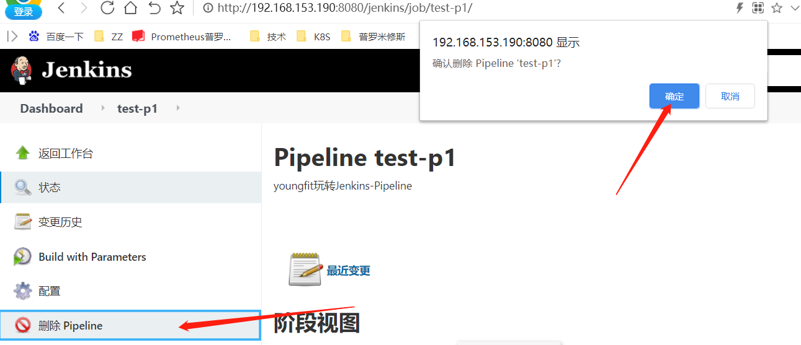

# Jenkins-Credentials


```plain
如果要是把它理解为“钥匙”，那就不需要我进行过多的解释了，我们以git（版本控制器）为例来进行说明，当我们在访问gitlab时，其实gitlab是需要我们提供相应的账号与密码进行登录的，假如说我们把要访问的URL地址理解为锁，那么所提供的账号与密码就对应于开这把锁的钥匙，所以说“Credentials”中所记录的就是各种各样的这种钥匙，而这里的钥匙对应的锁是有多种可能的，可能是git，也可能是SVN等，而“Credentials”就是对于这些钥匙所进行的统一管理
```


## 添加Credentials


```shell
[root@jenkins-server1 ~]# cat /root/.ssh/id_rsa
```


# Jenkins-Pipeline


jenkins的pipeline功能，如今被一线企业热衷，受用率飙升迅速；


Jenkins Pipeline 的核心概念


Pipeline，简而言之，就是一套运行于Jenkins上的工作流框架，将原本独立运行于单个或者多个节点的任务连接起来，实现单个任务难以完成的复杂流程编排与可视化。


Pipeline是Jenkins2.X的最核心的特性，帮助Jenkins实现从CI到CD与DevOps的转变


Pipeline是一组插件，让Jenkins可以实现持续交付管道的落地和实施。


持续交付管道（CD Pipeline）是将软件从版本控制阶段到交付给用户或客户的完整过程的自动化表现。软件的每一次更改（提交到源代码管理系统）都要经过一个复杂的过程才能被发布。


Pipeline提供了一组可扩展的工具，通过Pipeline Domain Specific Language（DSL）syntax可以达到Pipeline as Code（Jenkinsfile存储在项目的源代码库）的目的。


# Jenkins Pipeline的基础语法


Pipeline脚本是由Groovy语言实现（无需专门学习）


```plain
支持两种语法
Declarative 声明式（在Pipeline plugin 2.5中引入）
Scripted Pipeline 脚本式
```


### 一、声明式（jenkins2.5新加入的语法）


```plain
特点：
1.最外层必须由pipline{ //do something }来进行包裹
2.不需要分号作为分隔符，每个语句必须在一行内
3.不能直接使用groovy语句（例如循环判断等），需要被script {}包裹
```


#### 声明式pipeline案例：


```shell
pipeline {
    agent any   //没有指定agent
    stages{ 	//步骤
        stage('checkout code'){  //第一个步骤
            steps {
                sh 'echo "youngfit!!!"'
            }
        }
    }
}
```


```shell
pipeline{
    agent any
    stages{
        stage('mvn-version'){
            steps{
                sh 'mvn -v'
            }
        }
        stage('jdk-version'){
            steps{
                sh 'java -version'
            }
        }
    }
}
```


##### 1.参数详解


```plain
agent：该部分指定整个Pipeline或特定阶段将在Jenkins环境中执行的位置，具体取决于该agent 部分的放置位置。该部分必须在pipeline块内的顶层定义 ，也可以使用在stage级。
stage：表示这个Pipeline的某一个执行阶段（使用stage使得逻辑变得更加简单明了）
steps: 包含一个或者多个在stage块中执行的step序列（在这里执行操作：运行maven或者部署等等）
environment：指定键值对，可用于step中，主要是为常量或者变量赋值，根据所在的位置来决定其作用范围（类似于java中全局和局部的概念）
options：允许执行pipeline内置的专用选项，也可以使用由插件提供的
parameters:提供触发pipeline时的参数列表
trigger：定义了触发pipeline的方式（jenkins1.x中的pollscm定时构建）
tools:自动安装工具，注意这里使用的一定是在jenkins全局配置中已经定义好了的
when：可以用来执行一些代码逻辑
post:可以根据pipeline的状态来执行一些操作
```


```plain
agent的一些参数如下：
any ： 在任何可用的机器上执行pipeline
none ： 当在pipeline顶层使用none时，每个stage需要指定相应的agent
agent{ label 'slave1' }
```


##### 2.agent指定


###### 2.1 labels


```shell
pipeline{
    agent { label 'master'}  //指定在哪个节点运行，后面的步骤都在指定的节点运行
    stages{
        stage('mvn-version'){
            steps{
                sh 'mvn -v'
            }
        }
        stage('jdk-version'){
            steps{
                sh 'java -version'
            }
        }
    }
}
```


###### 2.2 agent none


```shell
pipeline{
    agent none  //如果这里是none，后面每一步，都要指定运行节点
    stages{
        stage('mvn-version'){
        	agent { label 'master'}
            steps{
                sh 'mvn -v'
            }
        }
        stage('jdk-version'){
        	agent { label 'node'}
            steps{
                sh 'java -version'
            }
        }
    }
}
```


###### 2.3 agent docker


```shell
pipeline {
    agent {
        docker { image 'maven:latest' }
    }
    stages {
        stage('Test') {
            steps {
                sh 'mvn -v'
            }
        }
    }
}
```


###### 2.4 options


```shell
## 设置保存最近的记录
options { buildDiscarder(logRotator(numToKeepStr: '1')) }
 
## 禁止并行构建，因为用的worksapce还是同一个
options { disableConcurrentBuilds() }
 
## 跳过默认的代码检出
options { skipDefaultCheckout() }
 
## 设定流水线的超时时间(可用于阶段级别)
options { timeout(time: 1, unit: 'HOURS') }
 
## 设定流水线的重试次数(可用于阶段级别)
options { retry(3) }
 
## 设置日志时间输出(可用于阶段级别)
options { timestamps() }

#示例：
pipeline {
	agent any
    options {
        buildDiscarder(logRotator(numToKeepStr: '1'))
        disableConcurrentBuilds()
        skipDefaultCheckout()
        timeout(time: 1, unit: 'HOURS')
        timestamps()
        retry(3)
    }
    stages {
    	stage ('test1') {
    	    environment {
    	        name = '飞哥'
    	    }
    		steps {
    			sh 'echo "The username  is ${name}"'
    		}
    	}
    }
}
```


###### 2.5 environment

```shell
pipeline {
    agent any
    environment {
        unit_test = 'true'
        username = 'youngfit'
        company = '云科技有限公司'
    }
    stages {
        stage('Example') {
            steps {
                sh 'echo ${username} 在 ${company} 工作是 ${unit_test}的' 
            }
        }
    }
}
```


###### 2.6 parameters


```shell
pipeline {
    agent any
    environment {
        unit_test = 'true'
        username = 'youngfit'
        company = '云科技有限公司'
    }
    parameters {
        string defaultValue: 'jenkins:1.1.1', description: '版本号', name: 'Version', trim: true
    }
    stages {
        stage('Example') {
            steps {
                sh 'echo ${username} 在 ${company} 工作是 ${unit_test}的' 
                echo "${params.Version}"
            }
        }
    }
}
```


###### 2.7 tools

```shell
// String description = "版本号"
pipeline {
    agent any
    environment {
        unit_test = 'true'
        username = 'youngfit'
        company = '云科技有限公司'
    }
    tools {
        maven 'maven-jdk8'
        jdk 'java1.8'
    }
    stages {
        stage('Example') {
            steps {
                sh 'echo ${username} 在 ${company} 工作是 ${unit_test}的' 
                sh 'java -version'
                sh 'mvn -v'
            }
        }
    }
}
```


###### 2.8 Parallel并串行化


```shell
// String description = "版本号"
pipeline {
    agent any
    stages {
        stage('Stage1') {
            steps {
                sh 'echo "步骤1"'
            }
        }
        stage('并行执行的 Stage') {
            parallel {
                stage('Stage2.1') {   //Stage2.1、2.2和2.3是并行的，但是Stage2.3中的2步仍是串行的
                    // agent { label "test1" }
                    steps {
                        echo "在 agent test1 上执行的并行任务 1."
                    }
                }
                stage('Stage2.2') {
                    // agent { label "test2" }
                    steps {
                        echo "在 agent test2 上执行的并行任务 2."
                    }
                }
                stage('Stage2.3') {
                    stages {
                        stage ('串行1') {
                            steps {
                                echo "在 agent test2 上执行的串行任务 1."
                            } 
                        }
                        stage ('串行2') {
                            steps {
                                echo "在 agent test2 上执行的串行任务 2."
                            }
                        }
                    }
                }
            }
        }
    }
}
```


测试串行

```shell
pipeline {
    agent any
    stages {
        stage('测试串行1'){
            steps{
                sh 'date'
                sh 'dd if=/dev/zero of=/tmp/cloud1.txt count=1024 bs=1M'
            }
        }
        stage('测试串行2'){
            steps{
                sh 'date'
                sh 'dd if=/dev/zero of=/tmp/cloud2.txt count=1024 bs=1M'
            }
        }
    }
}
```


测试串行

```shell
pipeline {
    agent any
    stages {
        stage('测试并行执行'){
            parallel {
                stage('测试并行1'){
                    steps{
                        sh 'date'
                        sh 'dd if=/dev/zero of=/tmp/cloud1.txt count=1024 bs=1M'
                    }
                }
                stage('测试并行2'){
                    steps{
                        sh 'date'
                        sh 'dd if=/dev/zero of=/tmp/cloud2.txt count=1024 bs=1M'
                    }
                }
            }
        }
    }
}
```


###### 2.9 post钩子


```plain
post 步骤在Jenkins pipeline语法中是可选的，包含的是整个pipeline或阶段完成后一些附加的步骤。 比如我们希望整个pipeline执行完成之后或pipeline的某个stage执行成功后发送一封邮件，就可以使用post，可以理解为"钩子"。

根据pipeline或阶段的完成状态，post部分分成多种条件块，包括： 
• always：不论当前完成状态是什么，都执行。 
• changed：只要当前完成状态与上一次完成状态不同就执行。 
• fixed：上一次完成状态为失败或不稳定（unstable），当前完成状态为成功时执行。 
• regression：上一次完成状态为成功，当前完成状态为失败、不稳定或中止（aborted）时执行。 
• aborted：当前执行结果是中止状态时（一般为人为中止）执行。 
• failure：当前完成状态为失败时执行。 
• success：当前完成状态为成功时执行。 
• unstable：当前完成状态为不稳定时执行。 
• cleanup：清理条件块。不论当前完成状态是什么，在其他所有条件块执行完成后都执行。post部分可以同时包含多种条件块。

以下是 post 部分的完整示例
```


```shell
pipeline {
  agent { label 'master' }
  stages {
     stage('buildCode') {
       steps {
         echo "building all codes1"
       } 
      post {
        always {
          echo 'scp code.tar to apps'
        }
      }
     }
  }

  post {
    changed {
       echo 'pipeline post changed'
    }
    always {
       echo 'pipeline post always'
    }
    success {
       echo 'pipeline post success'
    }
    // 省略其他条件块
  }
}
```


```shell
//failure测试
pipeline {
  agent { label 'master' }
  stages {
     stage('buildCode') {
       steps {
         echo "building all codes1"
       } 
      post {
        always {
          sh 'mkdir /opt/a/ab'   //这一步是会失败的
        }
      }
     }
  }

  post {
    failure {
        echo 'pipeline post failure'   //会执行这一步
    }
  }
}
```


其他的，兄弟们就自己玩着测试吧！！！


###### 2.10 when


```plain
指令2： when

该when指令允许Pipeline根据给定的条件确定是否执行该阶段。该when指令必须至少包含一个条件。如果when指令包含多个条件，则所有子条件必须为舞台执行返回true。这与子条件嵌套在一个allOf条件中相同（见下面的例子）。

更复杂的条件结构可使用嵌套条件建：not，allOf或anyOf。嵌套条件可以嵌套到任意深度。When{…}是写在stage{…}里面一层条件控制，下面来看看when{…}支持的一些内置条件命令。

branch
当正在构建的分支与给出的分支模式匹配时执行阶段，例如：when { branch 'master' }。请注意，这仅适用于多分支Pipeline。

environment
当指定的环境变量设置为给定值时执行阶段，例如： when { environment name: 'DEPLOY_TO', value: 'production' }

expression
当指定的Groovy表达式求值为true时执行阶段，例如： when { expression { return params.DEBUG_BUILD } }

not
当嵌套条件为false时执行阶段。必须包含一个条件。例如：when { not { branch 'master' } }

allOf
当所有嵌套条件都为真时，执行舞台。必须至少包含一个条件。例如：when { allOf { branch 'master'; environment name: 'DEPLOY_TO', value: 'production' } }

anyOf
  当至少一个嵌套条件为真时执行舞台。必须至少包含一个条件。例如：when { anyOf { branch 'master'; branch 'staging' } }
举例一个 使用expression条件的when的代码示例。
```


```shell
pipeline {
    agent any
    stages {
        stage('Example Build') {
            steps {
                script {
                    echo 'Hello World'
                }
            }
        }
        stage('Example Deploy') {
            when {
                expression { 
                   return  (1 == 1) //返回值为True
                }
            }
            steps {
                echo 'Deploying'
            }
        }
    }
}
```


```shell
##environment测试
pipeline {
    agent any
    environment {
        username = 'youngfit'
    }
    stages {
        stage('Example Build') {
            steps {
                script {
                    echo 'Hello World'
                }
            }
        }
        stage('Example Deploy') {
            when {
                environment name: 'username', value: 'youngfit'
            }
            steps {
                echo 'youngfit'
            }
        }
    }
}
```


###### 2.11 pipeline scm


###### 2.12 pipeline scm项目实战


本次构建基于二.12之后


将代码写入仓库的Jenkinsfile中；进行构建:


```shell
node {
    //def gitUrl = "git@gitee.com:youngfit/easy-springmvc-maven.git"
  	def gitUrl = "http://10.8.166.234/gitlab-instance-195d1bc1/easy-springmvc-maven.git"
    def git_Branch = 'main'
    value = "=========================================================="
    stage ('拉取代码') {
        print "${value}"
        git branch: "${git_Branch}", url: "${gitUrl}", credentialsId: "1"
    }
    
    stage ('编译打包') {
        print "${value}"
        sh 'mvn clean package'
    }
    
    stage ('scp发布到tomcat后端服务') {
        print '${values}'
        sh 'ansible-playbook /etc/ansible/jenknis_scp.yaml'
        // sh 'sleep 40'
        sh 'ansible java-server1 -m shell -a "nohup /opt/script/app-jenkins.sh &"'
    }
}
```


###### 2.13 上线企业k8s容器化应用


描述：利用pipeline代码，上线公司企业级容器应用

1.Jenkins服务器拉取代码

2.Jenkins服务器编译打包，生成war包

3.jenkins服务器利用Dockerfile将新war包拷入镜像，生成新的镜像，镜像标签随着tag而变化(Dockerfile是在代码仓库中的，也就是开发人员每次推送代码，也会夹带着一个Dockerfile推送过去)

4.将镜像推送到远程镜像仓库中，推送成功删除镜像

5.jenkins服务器利用ansible对k8s-master节点进行更新镜像


###### 2.13.1 Jenkins服务器配置


```shell
配置解析
[root@jenkins-server1 ~]# cat /etc/hosts 将K8s主节点的解析
```


```shell
下载ansbile
[root@jenkins-server1 ~]# yum -y install epel-release ; yum -y install ansible
配置ansible主机清单
[root@jenkins-server1 ~]# cat /etc/ansible/hosts  #在最后面添加
```


```shell
发送公钥到k8s-master节点
[root@jenkins-server1 ~]# ssh-copy-id -i k8s-master
```


```shell
测试连通性
[root@jenkins-server1 ~]# ansible k8s-master -m ping
```


###### 2.13.2 k8s主节点配置


```shell
#已有的deployment。是一个tomcat容器多副本的deployment
[root@k8s-master tomcat]# pwd
/root/tomcat
[root@k8s-master tomcat]# vim tomcat.yaml
apiVersion: apps/v1
kind: Deployment
metadata:
  name: tomcat-deployment
spec:
  selector:
    matchLabels:
      app: tomcat
  replicas: 1
  template:
    metadata:
      labels:
        app: tomcat
    spec:
      nodeName: k8s-node1
      containers:
      - name: tomcat
        image: daocloud.io/library/tomcat:8.0.45
        ports:
        - containerPort: 8080
#为了看效果，创建1个servcie，让tomcat能够访问
[root@k8s-master tomcat]# cat tomcat-service.yaml 
apiVersion: v1
kind: Service
metadata:
  name: tomcat-service
spec:
  type: NodePort  #类型
  ports:
    - port: 8080
      nodePort: 30002
      targetPort: 8080
  selector:   #选择器
    app: tomcat  #对应上deployment给设置的标签
[root@k8s-master tomcat]# kubectl apply -f tomcat.yaml
[root@k8s-master tomcat]# kubectl apply -f tomcat-service.yaml
```





上面是公司已有的k8s中tomcat的pod，现在的需求是：


要实现持续集成/持续交付的容器更新，更新的代码，是要更新到容器中，并且重启，才能生效


###### 2.13.3 更新仓库


我这里用的是gitee的仓库，同步的github上一个开源的项目代码


模拟开发人员更新代码，开发人员肯定使用自己电脑上的git客户端工具进行提交，我这里用虚拟机


```shell
[root@git-client tmp]# git clone  git@gitee.com:youngfit/easy-springmvc-maven.git
```


```shell
[root@git-client tmp]# cd easy-springmvc-maven/
[root@git-client easy-springmvc-maven]# vim Dockerfile
FROM daocloud.io/library/tomcat:8.0.45 #这里基于tomcat的一个镜像，从daocloud上找的拉取链接
RUN rm -rf /usr/local/tomcat/webapps/* #删除镜像中tomcat默认发布目录下的内容，方便后续放更新的war包
ADD ./target/easy-springmvc-maven.war /usr/local/tomcat/webapps/ #将编译打包好的war包，拷贝进来
ENTRYPOINT ["/usr/local/tomcat/bin/catalina.sh","run"]  #启动tomcat
```


当然，我这里没有对代码进行更新；只添加了1个Dockerfile，下面提交代码到gitee仓库中，提交到仓库之前打tag；


```shell
[root@jenkins-server1 easy-springmvc-maven]# git add *
[root@jenkins-server1 easy-springmvc-maven]# git commit -m "v2.0"
[root@jenkins-server1 easy-springmvc-maven]# git tag -a "v2.0" -m "v2.0"
[root@jenkins-server1 easy-springmvc-maven]# git checkout v2.0 #这一步不用做
[root@jenkins-server1 easy-springmvc-maven]# git push origin v2.0
```





###### 2.13.3 pipeline代码


Docker仓库如果是私有仓库，请参考链接：


https://www.jianshu.com/p/fd13c2762d81


https://kubernetes.io/docs/concepts/containers/images/


```shell
pipeline {
    agent {label 'master'}
    //设置环境变量，自定义即可
    environment {
        gitee_url = "git@gitee.com:youngfit/easy-springmvc-maven.git"
        gitee_branch = "master"
        image_url = "registry.cn-beijing.aliyuncs.com/youngfit/tomcat:${tag}"
        k8s_master = "k8s-master"
        NS = "default"
    }
	//拉取代码
    stages {
        stage('拉取代码') {
            steps {
                script{
                    git branch: "${gitee_branch}", url: "${gitee_url}"
                    sh "git checkout ${tag}; git branch"
                }
            }
        }
        //编译打包
        stage('编译打包') {
            steps {
               sh "cd /root/.jenkins/workspace/test-p1"
               sh "mvn clean package"
            }
        }
        //生成新的docker镜像
        stage('构建镜像') {
            steps {
               sh "docker build -t tomcat:${tag} ." //上一步已经切换到了Dockerfile所在的目录
            }
        }
        //将镜像上传至仓库，我这里用的是阿里云仓库，你也可以换成harbor都行；
        stage ("上传镜像到aliyun仓库") {
            steps {
                sh "docker login -u youngfit -p QianFeng@123 registry.cn-beijing.aliyuncs.com"
                sh "docker tag tomcat:${tag} registry.cn-beijing.aliyuncs.com/youngfit/tomcat:${tag}"
                sh "docker push registry.cn-beijing.aliyuncs.com/youngfit/tomcat:${tag} && docker rmi  registry.cn-beijing.aliyuncs.com/youngfit/tomcat:${tag} tomcat:${tag}" 
            }
        }
        //更新k8s容器
        stage ("k8s集群更新docker镜像") {
            steps {
                sh "ansible '${k8s_master}' -m shell -a 'kubectl set image deployment tomcat-deployment tomcat=registry.cn-beijing.aliyuncs.com/youngfit/tomcat:${tag} -n ${NS}'"
            }
        }
    }
}
```


###### 2.13.4 进行构建


###### 2.13.5 访问测试


###### 2.13.6 再次模拟代码更新


开发人员：


```shell
[root@git-client webapp]# pwd
/tmp/easy-springmvc-maven/src/main/webapp
[root@git-client webapp]# ls
index.jsp  result.jsp  WEB-INF
[root@git-client webapp]# vim index.jsp
```


代码推送到仓库，记得打tag


```shell
[root@git-client webapp]# cd ../../..
[root@git-client easy-springmvc-maven]# pwd
```


```shell
[root@git-client easy-springmvc-maven]# git add *
[root@git-client easy-springmvc-maven]# git commit -m "v2.1"
[root@git-client easy-springmvc-maven]# git tag -a "v2.1" -m "v2.1"
[root@git-client easy-springmvc-maven]# git checkout v2.1
[root@git-client easy-springmvc-maven]# git push origin v2.1
```


再次构建





###### 2.13.7kubernetes配置secret拉取私仓镜像

对于公司内部的项目, 我们不可能使用公有开放的镜像仓库, 一般情况可能会花钱买 `docker`私仓服务, 或者说自己在服务器上搭建自己的私仓, 但不管怎样, 我们如何让`k8s`能够拉取私有仓库的镜像


1. 登录`docker`镜像仓库


这里以`阿里云docker镜像仓库`为例


```plain
[root@k8s-master tomcat]# docker login --username=you*** --password=**** registry.cn-hangzhou.aliyuncs.com
```


1. 生成密钥`secret`


```plain
[root@k8s-master tomcat]# kubectl create secret docker-registry regsecret --docker-server=registry.cn-hangzhou.aliyuncs.com --docker-username=you*** --docker-password=Syf*** --docker-email=908***@qq.com

其中:
regsecret: 指定密钥的键名称, 可自行定义
--docker-server: 指定docker仓库地址
--docker-username: 指定docker仓库账号
--docker-password: 指定docker仓库密码
--docker-email: 指定邮件地址(选填)
```


可以看到当前除了默认的密钥, 还有我们刚才生成的. 另外要注意的是, 该密钥只能在对应namespace使用, 也就是这里的default, 如果需要用到其他namespace, 比如说test, 就需要在生成的时候指定参数 -n test

1. yml文件加入密钥参数

[root@k8s-master tomcat]# vim tomcat.yml


其中imagePullSecrets是声明拉取镜像时需要指定密钥, regsecret 必须和上面生成密钥的键名一致, 另外检查一下pod和密钥是否在同一个namespace, 之后k8s便可以拉取镜像

再次构建


就会成功了；

### 二、脚本式Script


```plain
特点：
1.最外层有node{}包裹
2.可直接使用groovy语句
```


如何创建最基本的PIpeline
直接在Jenkins Web UI 网页界面中输入脚本
通过创建一个jenkinsfile可以检入项目的源代码管理库


```plain
通常推荐在Jenkins中直接从源代码控制（SCM）中载入Jenklinsfile Pipeline
```


#### 脚本式pipeline案例：


##### 1.引用linux命令


```shell
node {
    stage('step1'){
      sh 'touch /home/qf.txt'
      sh 'echo "Jenkins-pipeline\ntest1" >> /home/qf.txt'
    }
}
```


```shell
[root@jenkins-server1 .jenkins]# cat /home/qf.txt 
Jenkins-pipeline
test1
```


如果有jenkins从节点，想要指定在从节点上面执行，可以这样写


```shell
node ('node-test1') {   //括号中，指定从节点名称；
    stage('step1'){
      sh 'touch /home/qf.txt'
      sh 'echo "Jenkins-pipeline\ntest1" >> /home/qf.txt'
    }
}
```


##### 2.设置变量


```shell
//为注释，鼠标多行标记，CTRL+/即可
node {
    def username = "飞哥"  //def可加可不加
    stage ('step1') {
        print "${username}"
    //   sh 'touch /home/qf.txt'
    //   sh 'echo "Jenkins-pipeline\ntest1" >> /home/qf.txt'
    }
}
```


##### 3.自定义分隔符


```shell
node {
    def username = "飞哥"
    value = "****************************************************"
    stage ('step1') {
        print "${username}"
    }
    stage ('step2') {
        print "${value}"
        sh 'echo "youngfit2022"'
    }
}
```


##### 4.列表

```shell
node {
    def username = "飞哥"
    list dest_servers = ["192.168.153.190", "192.168.153.195"]
    value = "****************************************************"
    stage ('step1') {
        print "${username}"
    }
    stage ('step2') {
        print "${value}"
        sh 'echo "youngfit2022"'
    }
    stage ('ping3') {
        print "${value}"
        String dest_num1 = dest_servers[0]
        sh "ping -c3 ${dest_num1}"
    }
}
```


##### 5.for循环，遍历列表


不使用之前


```shell
node {
    def username = "飞哥"
    host1 = "192.168.153.195"   //定义多个变量，比较麻烦
    host2 = "192.168.153.196"
    value = "****************************************************"
    stage ('step1') {
        print "${username}"
    }
    stage ('step2') {
        print "${value}"
        sh 'echo "youngfit2021"'
    }
    stage ('ping3') {
        print "${value}"
        sh "ping -c2 ${host1}"
        sh "ping -c2 ${host2}"
    }
}
```


可以使用列表


```shell
node {
    def username = "飞哥"
    list dest_servers = ["192.168.153.190", "192.168.153.195"]
    value = "****************************************************"
    stage ('step1') {
        print "${username}"
    }
    stage ('step2') {
        print "${value}"
        sh 'echo "youngfit2021"'
    }
    stage ('ping3') {
        print "${value}"
        for (i=0; i<dest_servers.size(); i++) {
            String dest_num1 = dest_servers[i]
            sh "ping -c2 ${dest_num1}"
        }
    }
}
```


##### 6.拉取代码


```shell
node {
    def githubUrl = "https://github.com/bingyue/easy-springmvc-maven"
    value = "****************************************************"
    stage ('step1') {
        print "${value}"
        git branch: "master", url: "${githubUrl}"
    }
}
```


我这里用gitee仓库创建了1个私有仓库


仓库url：git@gitee.com:youngfit/jenkins.git


```shell
#jenkins服务器制作密钥对
[root@jenkins-server1 ~]# yum -y install git
[root@jenkins-server1 ~]# git config --global user.name "feige"
[root@jenkins-server1 ~]# git config --global user.email "908367919@qq.com"
[root@jenkins-server1 ~]# ssh-keygen
#将公钥配置到gitee中
[root@jenkins-server1 ~]# cat /root/.ssh/id_rsa.pub
ssh-rsa AAAAB3NzaC1yc2EAAAADAQABAAABAQCzBgMIt5DPSY8In23zsTtyXcMdGk4AXtJlGBp177qxOYAscKuCycr3CZkH9fjNw/F6QMUcTcT0A4qjBxJdnHvnLfNOp2EwufBjBbWGGeiKNFmicm6slM+HT+JlhbDubUMD9YGi793dT+ie10Xt5veVvVFfjtQ4O2/Ic6mdmJDVajQL5YEaa72lR4rU8DegbY3t8Ux44Kzf1PANhMq3Swmi6q2E8UGjwU1LE1YzPqXO9otoDVDWSN9gNf/jzV/lY+4YMAriaKU+pkTzv3tVrGA/VY6QWxwMCloJY269Ql5dEXOEFNqHzd40vTD1qBmnNuypYOgC8vFh8TNUpie5tUg/ root@jenkins-server1
```


```shell
node {
    def githubUrl = "git@gitee.com:youngfit/jenkins.git"
    value = "****************************************************"
    stage ('step1') {
        print "${value}"
        git branch: "master", url: "${githubUrl}", credentialsId: '250'
    }
}
```


来到Jenkins服务器查看，代码拉取成功


##### 7.版本参数化构建


```plain
jenkins参数化构建
可以用git的分支、标签、修订/commit的版本来进行使用
这里我用的是标签的概念，也让我们再了解git的标签概念
说明"标签就是tag，是开发人员提交代码之前，可以给将要提交的代码打一个tag，比如v1.0，这样容易分辨代码的历史版本"
```


也就是说，Jenkins可以识别到仓库里面的分支，历史版本commit、和标签；


可以选择任何分支、任何历史版本、任何标签进行构建；所以，一旦新发布的代码有问题，我们还可以利用Jenkins重新构建一次没有问题的代码，确保应用使用正常；感受到jenkins的强大了嘛！！！


Jenkins安装git参数插件“Git Parameter”


###### 7.1标签式参数


添加git参数


标签/tag、每次提交代码的时候，可以打个tag，类似于版本号；这样可以明确历史版本。


首先用1台机器作为git客户端，拉取代码，修改代码，打tag，上传至远程仓库，这里远程仓库我用的仍是gitee。


这里git客户端机器，可以用新的，我这里仍然使用的jenkins服务器，各位应该都能看懂；


```shell
[root@git-client ~]# yum -y install git
[root@git-client ~]# git config --global user.name "jenkins"
[root@git-client ~]# git config --global user.email "feigeyoungfit@163.com"
[root@git-client ~]# git clone git@gitee.com:youngfit/easy-springmvc-maven.git
[root@git-client easy-springmvc-maven]# pwd
/root/easy-springmvc-maven
[root@git-client easy-springmvc-maven]# vim src/main/webapp/index.jsp
```


```shell
[root@git-client easy-springmvc-maven]# git add *
[root@git-client easy-springmvc-maven]# git commit -m "将jack改为了user"
[root@git-client easy-springmvc-maven]# git tag -a "v1.0" -m "将jack改为了user"
[root@git-client easy-springmvc-maven]# git push origin v1.0
```


仓库里不是代码，我们这里只是一些文件，看实验效果：


来到gitee页面查看


可以看到刚才开发人员推送的版本代码：


那么来到jenkins服务器


```shell
node {
    def githubUrl = "git@gitee.com:youngfit/jenkins.git"
    value = "****************************************************"
    stage ('step1') {
        print "${value}"
        git branch: "master", url: "${githubUrl}"
        print "${Tag}"
    }
}
```


```plain
[root@jenkins test-pip1]# vim src/main/webapp/index.jsp
```


其实不是出了问题，他拉取下来了，但是并不会自动切换tag，也就是位置仍然处于master分支，并没有切换到v1.0tag的位置；


```plain
#来到Jenkins的工作目录
[root@jenkins test-pip1]# pwd
/root/.jenkins/workspace/test-pip1
[root@jenkins test-pip1]# git checkout v1.0
```


如果，你想直接拉取之后，并切换到指定的tag版本中，可以这样写


```shell
node {
    def githubUrl = "git@gitee.com:youngfit/jenkins.git"
    value = "-------------------------------------------"
    stage ('step1') {
        print "${value}"
        git branch: "master", url: "${githubUrl}"
        print "${Tag}" //这里打印，只是在页面上显示一下tag，方便我们查看是否生效
        sh "git checkout ${Tag}; git branch"
    }
}
```


如果每次推送前都打一次tag，那我们再进行版本切换的时候，也就方便多了，比如开发更新了代码，再次推送，并且打了tag，如果推送的代码有问题，我们可以随时用jenkins进行重新构建；


模拟开发更新代码


```plain
[root@git-client easy-springmvc-maven]# vim src/main/webapp/index.jsp
```


```shell
[root@git-client easy-springmvc-maven]# git add *
[root@git-client easy-springmvc-maven]# git commit -m "用户&密码"
[root@git-client easy-springmvc-maven]# git tag -a "v1.1" -m "用户&密码"
[root@git-client easy-springmvc-maven]# git push origin v1.1
```








标签：也就是开发推送代码之前，我们要和他们沟通，每次推送前要打个tag，也就是给当前即将推送的代码打个版本号，方便后续我们的管理；各位程序猴应该体会到了~~


编译打包：


```shell
node {
    gitee_branch= "master"
    giteeUrl="git@gitee.com:youngfit/easy-springmvc-maven.git"
    war_src = "/root/.jenkins/workspace/test-pip1/target/easy-springmvc-maven.war"
    war_dest = "/root/upload/"
    stage("拉取gitee代码") {
        git branch: "${gitee_branch}", url: "${giteeUrl}", credentialsId: "250"
        // print "${Tag}"
        sh "git checkout ${Tag}"
    }
    stage("编译打包") {
        sh "mvn clean package"
    }
    stage("远程发送"){
        sh "scp ${war_src} 192.168.91.135:${war_dest}"
    }
    stage("自动发布"){
        sh "ansible tomcat1 -m shell -a 'nohup /opt/script/app-jenkins.sh &'"
    }
}
```

```shell
node {
    github_branch= "master"
    githubUrl="git@github.com:Asuka-EVA/easy-springmvc-maven.git"
#    war_src = "/root/.jenkins/workspace/test-pip1/target/easy-springmvc-maven.war"
#    war_dest = "/root/upload/"
    stage("拉取github代码") {
        git branch: "${github_branch}", url: "${githubUrl}", credentialsId: "250"
        // print "${Tag}"
        sh "git checkout ${Tag}"                                    
    }
    stage("编译打包") {
        sh "mvn clean package"
    }
    stage("远程发送"){
        sh "scp ${war_src} 192.168.174.xxx:${war_dest}"
    }
    stage("自动发布"){
        sh "ansible tomcat1 -m shell -a 'nohup /opt/script/app-jenkins.sh &'"
    }
}

```

这就是标签式参数化了，不过这种方式有个小缺陷，不是什么大问题；如果是第一次构建，也就是没有拉取过代码的时候，它是无法识别到仓库中的标签的，因为它根本没有尝试识别过仓库地址，更别说识别到里面的tag了；不过识别不到，我们就点击构建即可，让他拉取一次，第二次就可以识别到了


演示一下：


1.将刚才的pipline任务删除，或者新建1个pipeline任务都可以


我这里删除吧





然后，选择之前的配置，以及标签构建，配置之前的pipline代码


###### 7.2commit/修订式参数


标签式参数搞明白，这个也就容易了；简单说一下就行


```shell
node {
    def githubUrl = "git@gitee.com:youngfit/jenkins.git"
    value = "-------------------------------------------"
    stage ('step1') {
        print "${value}"
        git branch: "master", url: "${githubUrl}"
        print "${Commit}" //这里打印，只是在页面上显示一下commit历史id，方便我们查看是否生效
        sh 'git checkout ${Commmit}; git branch'
    }
}
```


所以，Jenkins是可以直接进行版本的切换构建，发布的，只不过我们这里没有设置后续的动作；各位要理解到位；


###### 7.3分支式参数


后续哥再整理！！个人感觉有上面2个，已经够用；


##### 8.脚本式中引用Credentials


其实，私有仓库，上面拉取代码应该是要凭证的，指定拉取代码的用户的公钥，要配置到私有仓库中，私钥要配置Jenkins中。上面gitee，并没有使用，也能正常拉取有点奇怪，应该是gitee没有这个要求，github和gitlab都是有要求的不过我们先不纠结这个；记得都配置就可以了；


我们现在用的是root用户，公钥已经配置到了gitee的配置中，私钥已经配置到了id为1的Credentials中；


下面再pipeline的代码中引用对应的Credentials即可


```shell
node {
    def githubUrl = "git@gitee.com:youngfit/jenkins.git"
    value = "-------------------------------------------"
    stage ('pull code') {
        print "${value}"
        git branch: "master", url: "${githubUrl}", credentialsId: "1"
    }
}
```


##### 9.定义多版本构建工具


虽然我们的Jenkins服务器上，暂时只有1个版本的jdk、和1个版本的maven工具；但是在公司的Jenkins服务器上，可能会有多个版本的Jdk或者maven工具，因为在构建一些项目代码时，可能需要用到jdk11的新特性，那么Jenkins服务器上就要有jdk11的版本；


```shell
#上传不同版本的jdk工具和maven工具包，到Jenkins服务器，解压，进行配置
[root@jenkins-server1 ~]# tar -xvzf openjdk-11+28_linux-x64_bin.tar.gz  -C /usr/local/
[root@jenkins-server1 ~]# tar -xvzf apache-maven-3.5.4-bin.tar.gz  -C /usr/local/jdk-11/
```


```shell
node {
    value = "-------------------------------------------"
    mavenHome = tool "maven-jdk11"  //这里tool指的是工具，工具名称和jenkins定义的要对应好
    env.MAVEN_HOME = "${mavenHome}"
    env.PATH = "${mavenHome}/bin:${env.PATH}"
    stage ('test1') {
        print "${env.PATH}"
        sh "mvn -version"
    }
}
```


```shell
#换成maven-jdk8,试试看效果
node {
    value = "-------------------------------------------"
    mavenHome = tool "maven-jdk8"  //这里tool指的是工具，工具名称和jenkins定义的要对应好
    env.MAVEN_HOME = "${mavenHome}"
    env.PATH = "${mavenHome}/bin:${env.PATH}"
    stage ('test1') {
        print "${env.PATH}"
        sh "mvn -version"
    }
}
```


##### 10.调用Docker容器


调用工具的时候，麻烦点在于，Jenkins服务器上安装对应工具，而且Jenkins服务也要添加上，后续pipeline的代码中，路径也要配置正确；


如果Jenkins服务器不想安装工具，可以使用docker容器的方式，比如拉取jdk的docker镜像，镜像中自然会有jdk工具，然后进行调用；那么Jenkins服务器要安装docker服务，Jenkins也要安装调用docker的插件


```shell
[root@jenkins-server1 yum.repos.d]# pwd
/etc/yum.repos.d

[root@jenkins-server1 yum.repos.d]# wget https://mirrors.aliyun.com/docker-ce/linux/centos/docker-ce.repo
[root@jenkins-server1 yum.repos.d]# yum -y install docker-ce
[root@jenkins-server1 yum.repos.d]# systemctl start docker && systemctl enable docker
```


###### 10.1安装调用docker的插件


###### 10.2调用node容器


```shell
node {
    value = "-------------------------------------------"
    stage ("test-node") {
        print "${value}"
        docker.image("node:14-alpine").inside{
            sh "node -v"
        }
    }
}
```


10.2调用jdk容器


```plain
[root@jenkins-server1 ~]# docker pull daocloud.io/ld00000/jdk-8:latest #提前拉取镜像也可以
```


```shell
node {
    value = "-------------------------------------------"
    stage ('test-jdk8') {
        docker.image ("daocloud.io/ld00000/jdk-8:latest").inside("-v /path:/path"){
            sh "java -version"
        }
    }
}
```


###### 10.2调用maven容器


```plain
[root@jenkins-server1 ~]# docker pull maven:latest #提前拉取镜像也可以
```


```shell
node {
    value = "-------------------------------------------"
    stage ('test-maven') {
        print "${value}"
        docker.image ("maven:latest").inside("-v /path:/path"){
            sh "mvn -v"
        }
    }
}
```


总之：想要调用什么工具的命令，就拉取对应的docker镜像，要比安装工具方便的多；注意我们现在调用之后，容器会自动关闭和删除；我们这里没有用工具做具体的运行服务的命令，先感受一下；


###### 10.3withDockerContainer语法风格


```shell
node {
    withDockerContainer (args: '-e "http_proxy=xxxx" -e "https_proxy=yyyyy" -v "/home:/home"',
    	image: "maven:latest") {
    	sh "cd /home && touch qf.txt"
    	sh "mvn -v"
    }
}

// args:添加的参数，可以-v挂载目录，-e设置变量，-p映射端口等
```


可以看到，jenkins本机保留了文件，成功了


##### 11.发送邮件


前提：Jenkins已安装邮箱插件，Jenkins已配置过关于邮箱的配置


```shell
node {
    stage ('email-test') {
        emailext (
            subject: 'test-jenkins',
            body: '''云计算，YYds!!!
                     千锋郑州云计算
                     享受学习,低调挣钱!!!''',
            to: '908367919@qq.com'
        )
    }
}
```


邮箱变量


```shell
node {
    stage ('email-test') {
        emailext (
            subject: 'test-jenkins',
            body: '构建通知：${PROJECT_NAME} - Build # ${BUILD_NUMBER} - ${BUILD_STATUS}!',
            to: '908367919@qq.com'
        )
    }
}
```


##### 12.实战项目Pipeline+Maven+Ansible+Tomcat

| Jenkins服务器 | 192.168.153.190 |
| ------------- | --------------- |
| java服务器    | 192.168.153.195 |


```shell
[root@jenkins-server1 ~]#  ssh-copy-id -i 192.168.153.195  //发送公钥
```


###### 12.1 Jenkins服务器配置解析


###### 12.2 Jenkins服务器Ansible配置


```shell
[root@jenkins-server1 ~]#  yum -y install epel-release
[root@jenkins-server1 ~]#  yum -y install  ansible
```


```shell
[root@jenkins-server1 ~]# cat /etc/ansible/hosts  #在最后面添加下面内容
[java-server]
java-server1
[java-server:vars]         #设置变量,vars--照写
ansible_ssh_port=22
ansible_ssh_user=root
ansible_ssh_private_key_file=/root/.ssh/id_rsa
#ansible_ssh_pass=test
```


```shell
[root@jenkins-server1 ~]# ansible java-server1 -m ping //测试连通性
```


###### 12.3 Jenkins剧本


```shell
[root@jenkins-server1 ~]# vim /etc/ansible/jenknis_scp.yaml 
---
- hosts: java-server1
  user: root
  vars:
  - source_war: "/root/.jenkins/workspace/test-p3/target/easy-springmvc-maven.war"
  - dest_war: "/root/upload"
  tasks:
  - name: scp war
    copy: src={{ source_war }} dest={{ dest_war }}
```


###### 12.4 后端服务器jdk、tomcat配置


```shell
[root@java-server ~]# tar -xvzf jdk-8u211-linux-x64.tar.gz  -C /usr/local/
[root@java-server ~]#  tar -xvzf apache-tomcat-8.5.45.tar.gz  -C /data/application/
[root@java-server ~]# cd /usr/local/
[root@java-server local]# mv jdk1.8.0_211/ java
[root@java-server local]# cd /data/application/
[root@java-server application]# mv apache-tomcat-8.5.45/ tomcat
```


配置环境变量


```shell
[root@java-server ~]# vim /etc/profile   //在最后面添加即可
export JAVA_HOME=/usr/local/java
export PATH=$JAVA_HOME/bin:$JAVA_HOME/jre/bin:$PATH
export CLASSPATH=.:$JAVA_HOME/lib:$JAVA_HOME/jre/lib:$JAVA_HOME/lib/tools.jar
export TOMCAT_HOME=/data/application/tomcat
```


测试jdk是否可用


```shell
[root@java-server ~]# mkdir /root/upload/   #创建接受war包的目录。我这里脚本定义的是此目录
[root@java-server ~]# rm -rf /data/application/tomcat/webapps/*
```


###### 12.5 后端服务器配置脚本


```plain
[root@java-server ~]# mkdir /opt/script
[root@java-server ~]# vim /opt/script/app-jenkins.sh  #编写重启tomcat的脚本
说明：此脚本定义了接受war的目录，tomcat的发布目录，主要的思路就是将发布过来的war包，移动到tomcat的发布目录下。
并检测tomcat是否已经运行，已运行的话，杀死启动，未运行，直接运行；
```


```shell
#!/usr/bin/bash
#本脚本适用于jenkins持续集成，实现备份war包到代码更新上线！使用时请注意全局变量。
#====================================================
#Defining variables
export JAVA_HOME=/usr/local/java
webapp_path="/data/application/tomcat/webapps"
tomcat_run="/data/application/tomcat/bin"
updata_path="/data/update/`date +%F-%T`"
backup_path="/data/backup/`date +%F-%T`"
tomcat_pid=`ps -ef | grep tomcat | grep -v grep | awk '{print $2}'`
files_dir="easy-springmvc-maven"
files="easy-springmvc-maven.war"
job_path="/root/upload"

#Preparation environment
echo "Creating related directory"
mkdir -p $updata_path
mkdir -p $backup_path

echo "Move the uploaded war package to the update directory"
mv $job_path/$files $updata_path

echo "========================================================="
cd /opt
echo "Backing up java project"
if [ -f $webapp_path/$files ];then
        tar czf $backup_path/`date +%F-%H`.tar.gz $webapp_path
        if [ $? -ne 0 ];then
                echo "打包失败，自动退出"
                exit 1
        else
                echo "Checking if tomcat is started"
                if [ -n "$tomcat_pid" ];then
                        kill -9 $tomcat_pid
                        if [ $? -ne 0 ];then
                                echo "tomcat关闭失败，将会自动退出"
                                exit 2
                        fi
                fi
                cd $webapp_path
                rm -rf $files && rm -rf $files_dir
                cp $updata_path/$files $webapp_path
                cd /opt
                $tomcat_run/startup.sh
                sleep 5
                echo "显示tomcat的pid"
                echo "`ps -ef | grep tomcat | grep -v grep | awk '{print $2}'`"
                echo "tomcat startup"
                echo "请手动查看tomcat日志。脚本将会自动退出"
        fi
else
        echo "Checking if tomcat is started"
        if [ -n "$tomcat_pid" ];then
                kill -9 $tomcat_pid
                if [ $? -ne 0 ];then
                        echo "tomcat关闭失败，将会自动退出"
                        exit 2
                fi
        fi
        cp $updata_path/$files $webapp_path
        nohup $tomcat_run/startup.sh &
        sleep 5
        echo "显示tomcat的pid"
        echo "`ps -ef | grep tomcat | grep -v grep | awk '{print $2}'`"
        echo "tomcat startup"
        echo "请手动查看tomcat日志。脚本将会自动退出"
fi
[root@java-server ~]# chmod +x /opt/script/app-jenkins.sh
```


###### 12.6 Jenkins pipeline代码


```shell
node {
    def gitUrl = "git@gitee.com:youngfit/easy-springmvc-maven.git"
    def git_Branch = 'master'
    value = "=========================================================="
    stage ('拉取代码') {
        print "${value}"
        git branch: "${git_Branch}", url: "${gitUrl}", credentialsId: "1"
    }
    
    stage ('编译打包') {
        print "${value}"
        sh 'mvn clean package'
    }
    
    stage ('scp发布到tomcat后端服务') {
        print '${values}'
        sh 'ansible-playbook /etc/ansible/jenkins_scp.yml'
        // sh 'sleep 40'
        sh 'ansible tomcat1 -m shell -a "nohup /opt/scripts/app-jenkins.sh &"'
    }
}
```


来到Jenkins服务器上查看：


来到java后端服务器上查看：


###### 12.7 结合git tag使用


更新代码


```shell
[root@git-client easy-springmvc-maven]# touch a.txt
[root@git-client easy-springmvc-maven]# git add *
[root@git-client easy-springmvc-maven]# git commit -m "add a.txt"
[master 80210ab] add a.txt
 1 file changed, 0 insertions(+), 0 deletions(-)
 create mode 100644 a.txt
[root@git-client easy-springmvc-maven]# git tag -a v1.1 -m "v1.1"
[root@git-client easy-springmvc-maven]# git push origin v1.1
Counting objects: 5, done.
Delta compression using up to 2 threads.
Compressing objects: 100% (3/3), done.
Writing objects: 100% (4/4), 439 bytes | 0 bytes/s, done.
Total 4 (delta 0), reused 0 (delta 0)
remote: Powered by GITEE.COM [GNK-6.1]
To git@gitee.com:youngfit/easy-springmvc-maven.git
 * [new tag]         v1.1 -> v1.1
```


再次拉取，就会有tag


```shell
node {
    gitee_url = "git@gitee.com:youngfit/easy-springmvc-maven.git"
    value = "=========================================================="
    stage('拉取代码'){
        print "${value}"
        git branch: "master", url: "${gitee_url}", credentialsId: "250"
        print "${tag}"
        sh "git checkout ${tag}"
    }
    stage('编译打包'){
        print "${value}"
        sh "mvn clean package"
    }
    stage('发布启动tomcat'){
        sh "ansible-playbook /etc/ansible/jenknis_scp.yaml"
        sh 'ansible java-server1 -m shell -a "nohup /opt/script/app-jenkins.sh &"'
    }
}
```