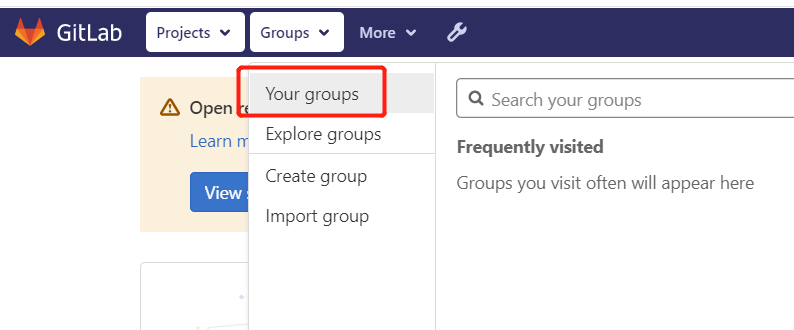
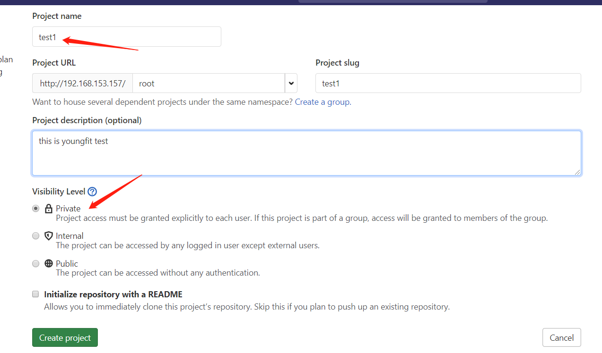
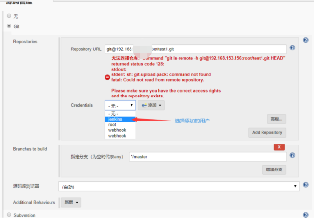

# Jenkins构建CI/CD

**什么是CI/CD**：持续集成/持续发布---开发(git) -->git主库-->jenkins(git+jdk+tomcat+maven打包+测试）-->发布到tomcat服务器

Jenkins是一个功能强大的应用程序，允许**持续集成和持续交付项目**，无论用的是什么平台。这是一个免费的源代码，可以处理任何类型的构建或持续集成。集成Jenkins可以用于一些测试和部署技术。Jenkins是一种软件.

官网地址：jenkins.io

# 为什么要 CI / CD 方法简介

软件开发的连续方法基于自动执行脚本，以最大限度地减少在开发应用程序时引入错误的可能性。从新代码的开发到部署，它们需要较少的人为干预甚至根本不需要干预。

它涉及在每次小迭代中不断构建，测试和部署代码更改，从而减少基于有缺陷或失败的先前版本开发新代码的机会。

这种方法有三种主要方法，每种方法都根据最适合您的策略进行应用。

**持续集成**(Continuous Integration, CI):  代码合并，构建，部署，测试都在一起，不断地执行这个过程，并对结果反馈。

**持续部署**(Continuous Deployment, CD):　部署到测试环境、预生产环境/灰度环境、生产环境。

**持续交付**(Continuous Delivery, CD):  将最终产品发布到生产环境、给用户使用。

# 一、jenkins介绍

Jenkins是帮我们将代码进行统一的编译打包、还可以放到tomcat容器中进行发布。
我们通过配置，将以前：编译、打包、上传、部署到Tomcat中的过程交由Jenkins，Jenkins通过给定的代码地址URL（代码仓库地址），将代码拉取到其“宿主服务器”（Jenkins的安装位置），进行编译、打包和发布到Tomcat容器中。

#### 1、Jenkins概述

```
是一个开源的、提供友好操作界面的持续集成(CI)工具，主要用于持续、自动的构建的一些定时执行的任务。Jenkins用Java语言编写，可在Tomcat等流行的容器中运行，也可独立运行。
```

jenkins通常与版本管理工具、构建工具结合使用；常用的版本控制工具有SVN、gitlab。jenkins构建工具有Maven、Ant、Gradle。

#### 2、Jenkins目标

① 持续、自动地构建/测试软件项目。

② 监控软件开发流程，快速问题定位及处理，提高开发效率。

#### 3、Jenkins特性

```shell
① 开源的java语言开发持续集成工具，支持CI，CD。
② 易于安装部署配置：可通过yum安装,或下载war包以及通过docker容器等快速实现安装部署，可方便web界面配置管理。
③ 消息通知及测试报告：集成RSS/E-mail通过RSS发布构建结果或当构建完成时通过e-mail通知，生成JUnit/TestNG测试报告。
④ 分布式构建：支持Jenkins能够让多台计算机一起构建/测试。
⑤ 文件识别:Jenkins能够跟踪哪次构建生成哪些jar，哪次构建使用哪个版本的jar等。
⑥ 丰富的插件支持:支持扩展插件，你可以开发适合自己团队使用的工具，如git，ssh，svn，maven，docker等。
```

工作流程图:


```shell
测试环境中：
1.开发者会将代码上传到版本库中。
2.jenkins通过配置版本库的连接地址，获取到源代码。
3.jenkins获取到源代码之后通过参数化构建(或者触发器)开始编译打包。
4.jenkins通过调用maven（Ant或者Gradle）命令实现编译打包过程。
5.生成的war包通过ssh插件上传到远程tomcat服务器中通过shell脚本自动发布项目。

生产环境：
测试环境将项目测试没问题后，将项目推送到线上正式环境。
1.可以选择手动。
2.也可以通过调用脚本推送过去。
```

#### 4、产品发布流程

产品设计成型 -> 开发人员开发代码 -> 测试人员测试功能 -> 运维人员发布上线

持续集成（Continuous integration，简称CI）

持续部署（continuous deployment）

持续交付（Continuous delivery）


# 二、部署应用Jenkins+Github+Tomcat实战

准备环境:

两台机器

git-server    ----[https://github.com/bingyue/easy-springmvc-maven](https://github.com/bingyue/easy-springmvc-maven)

jenkins-server    ---192.168.246.212---最好是3个G以上

java-server   -----192.168.246.210

[https://github.com/bingyue/easy-springmvc-maven](https://github.com/bingyue/easy-springmvc-maven)

### Jenkins2.303.1版本安装

### Yum安装

#### 1.配置 Jenkins的yum源

```
# wget -O /etc/yum.repos.d/jenkins.repo https://pkg.jenkins.io/redhat-stable/jenkins.repo
# rpm --import https://pkg.jenkins.io/redhat-stable/jenkins.io.key
# yum install epel-release java-11-openjdk-devel -y
# yum install jenkins -y
# systemctl daemon-reload
```

#### 2.启动Jenkins

```
# systemctl start jenkins
# systemctl status jenkins
[root@jenkins yum.repos.d]# tail -f /var/log/jenkins/jenkins.log
```


#### 3.访问登录

当您第一次访问一个新的 Jenkins 实例时，系统会要求您使用自动生成的密码将其解锁

1.浏览到`http://localhost:8080`（或您在安装时为 Jenkins 配置的任何端口）并等待**解锁 Jenkins**页面出现


2.从 Jenkins 控制台日志输出中，复制自动生成的字母数字密码（在 2 组星号之间）。


3.使用插件自定义 Jenkins  或者  推荐安装插件，荐安装插件。。。


#### 4.创建第一个管理员用户


### War包安装

#### 1.下载安装包

百度搜索openjdk11、tomcat、maven、jenkins


```shell
[root@jenkins ~]# wget https://download.java.net/openjdk/jdk11/ri/openjdk-11+28_linux-x64_bin.tar.gz
[root@jenkins ~]# wget https://get.jenkins.io/war/2.303/jenkins.war
[root@jenkins ~]# wget https://downloads.apache.org/maven/maven-3/3.8.2/binaries/apache-maven-3.8.2-bin.tar.gz
[root@jenkins ~]# wget https://dlcdn.apache.org/tomcat/tomcat-8/v8.5.70/bin/apache-tomcat-8.5.70.tar.gz
还有openjdk11
[root@jenkins ~]# cd /usr/local
[root@jenkins local]# tar -xvzf apache-maven-3.8.2-bin.tar.gz
[root@jenkins local]# tar -xvzf apache-tomcat-8.5.70.tar.gz
[root@jenkins local]# tar -xvzf openjdk-11+28_linux-x64_bin.tar.gz
[root@jenkins local]# mv jdk-11/ java
[root@jenkins local]# mv apache-tomcat-8.5.70 tomcat
[root@jenkins local]# rm -rf tomcat/webapps/*
[root@jenkins local]# mv apache-maven-3.8.2 java/maven
[root@jenkins ~]# cp jenkins.war  /usr/local/tomcat/webapps/
```

#### 2.配置环境变量

```shell
[root@jenkins ~]# vim /etc/profile
JAVA_HOME=/usr/local/java
MAVEN_HOME=/usr/local/java/maven
PATH=$PATH:$JAVA_HOME/bin:$MAVEN_HOME/bin
export PATH USER LOGNAME MAIL HOSTNAME HISTSIZE HISTCONTROL JAVA_HOME MAVEN_HOME

source /etc/profile

[root@jenkins ~]# java -version
openjdk version "11.0.12" 2021-07-20 LTS
OpenJDK Runtime Environment 18.9 (build 11.0.12+7-LTS)
OpenJDK 64-Bit Server VM 18.9 (build 11.0.12+7-LTS, mixed mode, sharing)

[root@jenkins ~]# mvn -v
Apache Maven 3.8.2 (ea98e05a04480131370aa0c110b8c54cf726c06f)
Maven home: /usr/local/java/maven
Java version: 11, vendor: Oracle Corporation, runtime: /usr/local/java
Default locale: en_US, platform encoding: UTF-8
OS name: "linux", version: "3.10.0-693.el7.x86_64", arch: "amd64", family: "unix"

[root@jenkins ~]# /usr/local/tomcat/bin/startup.sh
```

补充：如果启动访问报错

请更换jdk版本为1.8的，修改环境变量配置，重新启动即可；

#### 3.访问登录


#### 4.插件安装

```
安装插件:
所需的插件:
• Maven插件 Maven Integration plugin
• 发布插件 Deploy to container Plugin
需要安装插件如下：
=====================================================================================
安装插件
Deploy to container    ---支持自动化代码部署到tomcat容器
GIT plugin  可能已经安装,可在已安装列表中查询出来
Maven Integration   jenkins利用Maven编译，打包所需插件
Publish Over SSH  通过ssh连接
ssh  插件
安装过程:
系统管理--->插件管理---->可选插件--->过滤Deploy to container---->勾选--->直接安装
```


#### 5.配置国内源

因为Jenkins下载，默认是国外地址，如果插件下载失败，我们就替换为国内地址

官方下载插件慢 更新下载地址

Jenkins 安装时会默认从updates.jenkins-ci.org 拉取，我们需要换成国内源——清华大学开源软件镜像站。

[https://mirrors.tuna.tsinghua.edu.cn/jenkins/updates/update-center.json](https://mirrors.tuna.tsinghua.edu.cn/jenkins/updates/update-center.json)

cd    {你的Jenkins工作目录}/updates  进入更新配置位置

```shell
[root@jenkins-server1 updates]# pwd
/root/.jenkins/updates    #这是Jenkins默认的工作目录
[root@localhost updates]# vim  default.json      #修改配置文件
s/https:\/\/updates.jenkins.io\/download/http:\/\/mirrors.tuna.tsinghua.edu.cn\/jenkins/g' /root/.jenkins/updates/default.json            #官方源替换清华源
s/http:\/\/www.google.com/https:\/\/www.baidu.com/g    #google替换成百度

或者直接进行一下操作（一步到位，不需要多步操作）sed -i 's@原始信息@新内容@g'
[root@localhost ~]# sed -i 's/https:\/\/updates.jenkins.io\/download/http:\/\/mirrors.tuna.tsinghua.edu.cn\/jenkins/g' /root/.jenkins/updates/default.json && sed -i 's/http:\/\/www.google.com/https:\/\/www.baidu.com/g' /root/.jenkins/updates/default.json
```

之后，在网站后面加上restart进行jenkins重启。

[http://192.168.153.147:8080/jenkins/restart](http://192.168.153.147:8080/jenkins/restart)

#### 6.邮箱配置(可选)

安装邮件插件，才能确保邮件发送成功。否则可能不会发送邮件


可看到邮箱确实接收到了邮件，则配置成功；KYXDIMUFCNDXTBPJ

当然邮箱能接收到邮件的前提是，邮箱要开启smtp服务


#### 7.配置Jenkins私钥

```shell
[root@jenkins ~]# ssh-keygen
[root@jenkins ~]# cat /root/.ssh/id_rsa
```


#### 8.添加后端服务器

```
公钥发送到后端服务器，才能实现免密；
[root@jenkins ~]# ssh-copy-id -i root@192.168.153.194
```


#### 9.配置JDK和Maven

虽然Jenkins服务器上，已经安装了JDK和maven工具，但是，还需要在Jenkins服务中，进行配置；

这样Jenkins才能自动化的使用两个工具；

部署多个jdk环境，应对不同代码的构建


如果有多个jdk和maven需要配置的话，可以点击新增jdk或者新增maven；

#### 10.构建发布任务


[https://github.com/bingyue/easy-springmvc-maven](https://github.com/bingyue/easy-springmvc-maven)

这里是我再github上，找的一个测试的小项目。能进行编译打包


如果有多个后端服务器，可以点击 ADD server进行添加；

#### 11.java服务器添加脚本

```shell
[root@java-server ~]# mkdir -p /data/application
上传jdk
[root@java-server ~]# tar xzf jdk-8u191-linux-x64.tar.gz -C /usr/local/
[root@java-server ~]# cd /usr/local/
[root@java-server local]# mv jdk1.8.0_191/ java
下载tomcat
[root@java-server ~]# wget http://mirrors.tuna.tsinghua.edu.cn/apache/tomcat/tomcat-8/v8.5.42/bin/apache-tomcat-8.5.42.tar.gz
[root@java-server ~]# tar xzf apache-tomcat-8.5.42.tar.gz -C /data/application/
[root@java-server ~]# cd /data/application/
[root@java-server application]# mv apache-tomcat-8.5.42/ tomcat
设置环境变量
[root@java-server ~]# vim /etc/profile
export JAVA_HOME=/usr/local/java
export PATH=$JAVA_HOME/bin:$JAVA_HOME/jre/bin:$PATH
export CLASSPATH=.:$JAVA_HOME/lib:$JAVA_HOME/jre/lib:$JAVA_HOME/lib/tools.jar
export TOMCAT_HOME=/data/application/tomcat
[root@java-server ~]# source /etc/profile
测试:
[root@java-server ~]# java -version 
删除tomcat默认发布目录下面的内容:
[root@java-server ~]# rm -rf /data/application/tomcat/webapps/*
[root@java-server ~]# cd /data/application/tomcat/webapps/
[root@java-server webapps]# ls
创建目录和脚本:
[root@java-server ~]# mkdir /opt/script  #创建脚本目录
[root@java-server ~]# vim app-jenkins.sh   #创建脚本
脚本内容在后面：
[root@java-server ~]# chmod +x app-jenkins.sh  #添加执行权限
[root@java-server ~]# mv app-jenkins.sh /opt/script/
脚本内容:
[root@java-server script]# cat app-jenkins.sh 
#!/usr/bin/bash
#本脚本适用于jenkins持续集成，实现备份war包到代码更新上线！使用时请注意全局变量。
#================
#Defining variables
export JAVA_HOME=/usr/local/java
webapp_path="/data/application/tomcat/webapps"
tomcat_run="/data/application/tomcat/bin"
updata_path="/data/update/`date +%F-%T`"
backup_path="/data/backup/`date +%F-%T`"
tomcat_pid=`ps -ef | grep tomcat | grep -v grep | awk '{print $2}'`
files_dir="easy-springmvc-maven"
files="easy-springmvc-maven.war"
job_path="/root/upload"

#Preparation environment
echo "Creating related directory"
mkdir -p $updata_path
mkdir -p $backup_path

echo "Move the uploaded war package to the update directory"
mv $job_path/$files $updata_path

echo "========================================================="
cd /opt
echo "Backing up java project"
if [ -f $webapp_path/$files ];then
	tar czf $backup_path/`date +%F-%H`.tar.gz $webapp_path
	if [ $? -ne 0 ];then
		echo "打包失败，自动退出"
		exit 1
	else
		echo "Checking if tomcat is started"
		if [ -n "$tomcat_pid" ];then
			kill -9 $tomcat_pid
			if [ $? -ne 0 ];then
				echo "tomcat关闭失败，将会自动退出"
				exit 2
			fi
		fi
		cd $webapp_path
		rm -rf $files && rm -rf $files_dir
		cp $updata_path/$files $webapp_path
		cd /opt
		$tomcat_run/startup.sh
		sleep 5
		echo "显示tomcat的pid"
		echo "`ps -ef | grep tomcat | grep -v grep | awk '{print $2}'`"
		echo "tomcat startup"
		echo "请手动查看tomcat日志。脚本将会自动退出"
	fi
else
	echo "Checking if tomcat is started"
        if [ -n "$tomcat_pid" ];then
        	kill -9 $tomcat_pid
                if [ $? -ne 0 ];then
                	echo "tomcat关闭失败，将会自动退出"
                       	exit 2
                fi
        fi
	cp $updata_path/$files $webapp_path
	$tomcat_run/startup.sh
        sleep 5
        echo "显示tomcat的pid"
        echo "`ps -ef | grep tomcat | grep -v grep | awk '{print $2}'`"
        echo "tomcat startup"
        echo "请手动查看tomcat日志。脚本将会自动退出"
fi
```

#### 12.调用maven打包命令


#### 13.启用邮箱


#### 14.构建项目


# 三、Jenkins+Gitlab

Jenkins服务器去拉取代码。所以要下载git客户端

```shell
[root@jenkins-server ~]# yum -y install git
```


开始一个简单的项目


```shell
[root@jenkins ~]# cat /root/.ssh/id_rsa     //查看Jenkins服务器的私钥
```


Jenkins端配置好之后，还应在gitlab端配置Jenkins服务器的公钥

在jenkins服务器上查看公钥


复制粘贴到gitlab


然后去构建项目。自动拉取代码


注意看拉取到了哪个目录下


在Jenkins服务器上认证

在这个目录下能找到自己拉取git的项目；证明项目成功完成

```shell
[root@jenkins ~]#  ls /root/.jenkins/workspace/demo
beifen.sh
```

# 四、 Jenkins git参数化构建

git参数化构建：开发人员推送代码之前，对此版本的代码·，打一个标签(tag)。我们可以认作为是此套代码的版本号。后续可以方便我们进行版本之间的切换。尤其是刚上线一套代码有问题，可以运用jenkins立即进行版本回退/切换；

首先，需要安装插件"Git Parameter"。如图


#### 手动测试

```shell
[root@gitlab ~]# git clone git@192.168.182.128:root/easy-springmvc-maven.git
[root@gitlab ~]# cd easy-springmvc-maven
[root@gitlab easy-springmvc-maven]# cd src/main/webapp/
[root@gitlab easy-springmvc-maven]# cat src/main/webapp/index.jsp
```


```shell
[root@gitlab easy-springmvc-maven]# git add *
[root@gitlab easy-springmvc-maven]# git commit -m "修改用户为密码"
[root@gitlab easy-springmvc-maven]# git tag -a "v1.0" -m "修改用户为密码"
[root@gitlab easy-springmvc-maven]# git tag  #查看一下
v1.0
[root@gitlab easy-springmvc-maven]# git push origin v1.0
[root@gitlab easy-springmvc-maven]#
```


#### 配置Jenkins参数化构建


点击"高级"


# 五、Jenkins多节点配置

在企业里面使用Jenkins自动部署+测试平台时，每天更新发布几个网站版本,很频繁,但是对于一些大型的企业来讲，Jenkins就需要同时处理很多的任务，这时候就需要借助Jenkins多个node或者我们所说的Jenkins分布式SLAVE，今天我们带大家来学习Jenkins多实例的配置；

添加Linux平台Jenkins SLAVE配置：

1. 由于Jenkins是Java程序，添加的SLAVE客户端服务器必须安装Java JDK环境；
2. 创建远程执行Jenkins任务的用户，一般为Jenkins用户，工作目录为/home/Jenkins;
3. Jenkins服务器免秘钥登录Slave服务器或者通过用户名和密码登录；

Jenkins-master Jenkins-slave1

#### 1.添加从节点


#### 2.参数详解

```
名字：节点的名字
描述：说明这个节点的用途等
of executors:并发构建数量
远程工作目录：用于存放jenkins的工作空间的
标签：分配job会以标签的名称去分配
用法：节点的使用策略
启动方法：windows的话就不要给自己添堵了，选择 Java web start
```


#### 3.指定java命令路径


#### 4.测试从节点

项目指定到哪个节点运行。


# 六、Jenkins+Gitlab webhook触发自动构建项目

* 效果：只要Gitlab仓库代码更新，Jenkins自动拉取代码，完成构建任务。无需手动点击“立即构建”

* 需求场景：

  1、项目代码的更新迭代较多，每次点击比较麻烦

  2、更新的可能不是代码，可能是一些资源（比如：静态文件等）

### 安装配置Gitlab

Yum安装即可 ， 过程 略

Gitlab平台root用户密码配置为12345678

#### 创建组




#### 创建一个项目




在项目中随便新建个文件，当作代码文件


### 安装配置Jenkins

-----------------------------------------------------------------------------------------------

安装过程略

1.安装jdk

2.安装Tomcat

3.安装Maven（可选，不确定是否编译）

4.配置环境变量

5.启动

--------------------------------------------------------------------------------------------------------

#### 记得配置jdk和maven


#### 安装Gitlab hooks plugins插件

因为要用gitlab hook自动拉取代码的功能，需要安装GItlab hooks插件，才具有自动构建的功能

去“插件管理”页面，“可选插件”，搜索“Gitlab Hook Plugin和Gitlab Plugin”，点击“直接安装即可”

**注意：安装过程和网络有关。网络必须顺畅。且能正常连同国外Jenkins网站，才能下载成功**


#### 新建Gitlab webhook相关项目


Jenkins具体配置


来到Gitlab的test1项目中，复制拉取地址


粘贴到


出现一堆报红，正常！因为需要配置私钥和公钥

需要把Jenkins服务器的私钥，配置到test1项目中。把Jenkins服务器的公钥，配置到GItlab的服务里面。

这样拉取就可以免密了！


```shell
[root@jenkins-server ~]# useradd jenkins 
[root@jenkins-server ~]# su - jenkins 
[jenkins@jenkins-server ~]$ ssh-keygen 
[jenkins@jenkins-server ~]$ cat .ssh/id_rsa #查看jenkins用户的私钥
```




看到仍然报红，将jenkins服务器上面的jenkins用户的公钥添加到gitlab中


```shell
登录到jenkins服务器中
[jenkins@jenkins-server ~]$ cat .ssh/id_rsa.pub #查看jenkins用户的公钥
```


#### 构建触发器


**要记录下上边的URL和认证密钥，切换到gitlab，找到对应的git库点击setting --> webhook ,填写以下内容**

地址：http://192.168.153.149:8080/jenkins/project/webhook

Secret token：68ed645e3f6f51103fb32189d804498b

#### 配置GItlab


粘贴到此2处


添加完成之后报错


这是因为gitlab 10.6 版本以后为了安全，不允许向本地网络发送webhook请求，设置如下：

登录管理员账号


然后需要再次添加webhook，就会成功了。


成功了，才会显示出来


**回到jenkins页面**


#### 开始测试

```shell
在任何一台测试都可以。我这里在gitlab机器上面测试： 

[root@gitlab-server ~]# ssh-keygen #生成秘钥 
[root@gitlab-server ~]# cat .ssh/id_rsa.pub #查看生成的公钥添加到gitlab里面去
```


```shell
先克隆一下仓库 
[root@gitlab-server ~]# git clone git@192.168.153.157:root/test1.git Cloning into 'test1'... remote: Enumerating objects: 6, done. remote: Counting objects: 100% (6/6), done. remote: Compressing objects: 100% (4/4), done. remote: Total 6 (delta 0), reused 0 (delta 0), pack-reused 0 Receiving objects: 100% (6/6), done. 
[root@gitlab-server ~]# ls anaconda-ks.cfg test1 upload 
[root@gitlab-server ~]# cd test1/ 
[root@gitlab-server test1]# ls README.md 创建文件模拟代码提交到仓库 
[root@gitlab-server test1]# touch a.txt 
[root@gitlab-server test1]# git add . #把文件添加到暂存区 
[root@gitlab-server test1]# git commit -m 'test' [master 2451295] test 1 file changed, 0 insertions(+), 0 deletions(-) create mode 100644 a.txt 

将新代码，推动至Gitlab仓库，立刻去Jenkins查看。是否有新项目构建
[root@gitlab-server test1]# git push origin master #上传到中心仓库master分支 Counting objects: 4, done. Delta compression using up to 2 threads. Compressing objects: 100% (2/2), done. Writing objects: 100% (3/3), 296 bytes | 0 bytes/s, done. Total 3 (delta 0), reused 0 (delta 0) To git@192.168.153.156:root/test1.git f3848d7..2451295 master -> master
```

**返回到jenkins页面查看是否自动发布**


